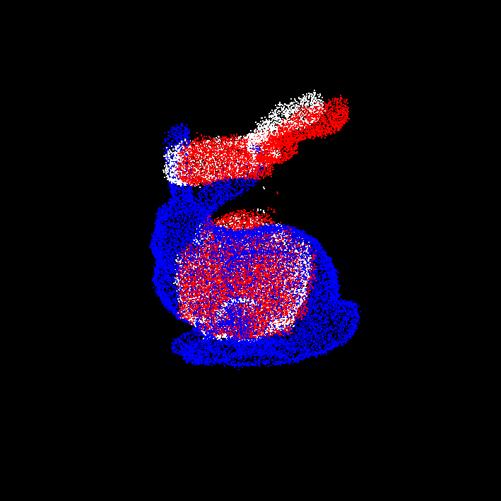
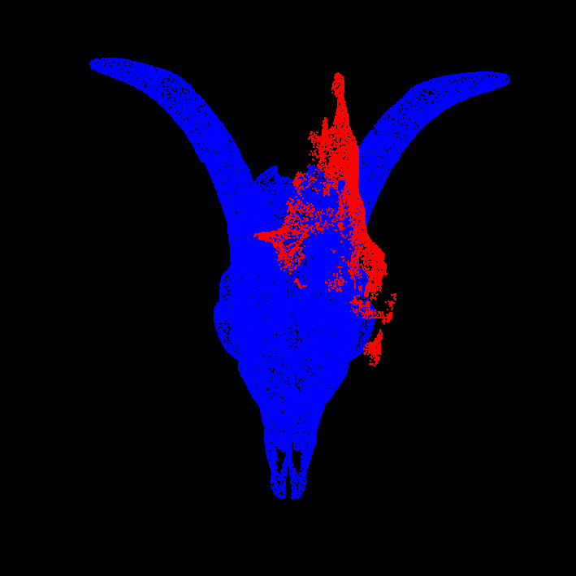
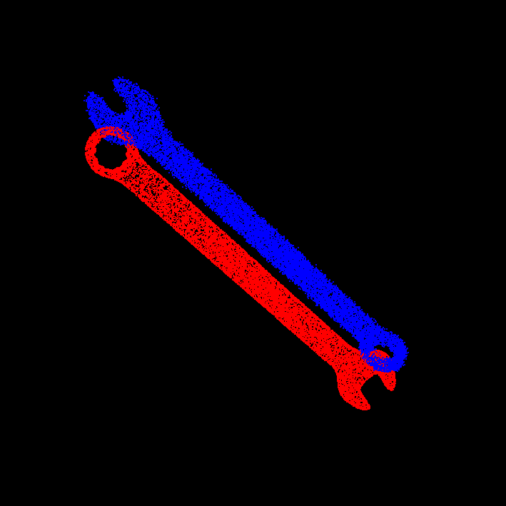

# Fast Globally Optimal ICP - A CUDA Implementation of [Go-ICP](https://github.com/yangjiaolong/Go-ICP)

**University of Pennsylvania, CIS 5650: GPU Programming and Architecture, Final Project**

* **Authors**: Mufeng Xu & Zhaojin Sun
* Tested on:
    * Windows 11/Ubuntu 24.04, i9-13900H @ 2.6GHz 32GB, RTX 4080 Laptop 12GB (Personal Computer)

## Demo

  
  
  

## Introduction

This project implements CUDA acceleration for ICP: the classic point cloud registration algorithm, and its globally optimal improvement, Go-ICP. The project also provides tools for visualization and performance measurement in [this repo](https://github.com/zjsun1017/CUDA-Go-ICP).

## Algorithm

The key algorithm in the globally optimal ICP problem is **Branch-and-Bound** (BnB),
global minimum is searched in the $SE(3)$ space (3D Rigid Rotation and Translation), which is 6-dimensional.

Instead of directly searching over $SE(3)$, it is proposed to launch an outer-BnB,
which searches over the $SO(3)$ space (3D Rotation) with BnB algorithm,
and for each branch, an inner-BnB function, which searches over the $\mathbb{R}^3$ space,
will be invoked.

Our CUDA acceleration focus on:
- Procrustes analysis in the ICP algorithm
- Nearest neighbor searfch
- Upper/Lower bounds (registration error) computation

## Dependencies

- OpenGL Mathematics (GLM)
- [TOML++](https://github.com/marzer/tomlplusplus)
- [tinyply](https://github.com/ddiakopoulos/tinyply)
- [nanoflann](https://github.com/jlblancoc/nanoflann)

## Reference

1. Jiaolong Yang, Hongdong Li, Dylan Campbell and Yunde Jia. [Go-ICP: A Globally Optimal Solution to 3D ICP Point-Set Registration](https://arxiv.org/pdf/1605.03344). IEEE Transactions on Pattern Analysis and Machine Intelligence (T-PAMI), 2016.
2. Jiaolong Yang, Hongdong Li and Yude Jia. [Go-ICP: Solving 3D Registration Efficiently and Globally Optimally](https://openaccess.thecvf.com/content_iccv_2013/papers/Yang_Go-ICP_Solving_3D_2013_ICCV_paper.pdf). International Conference on Computer Vision (ICCV), 2013.
3. [Go-ICP (GitHub)](https://github.com/yangjiaolong/Go-ICP)
